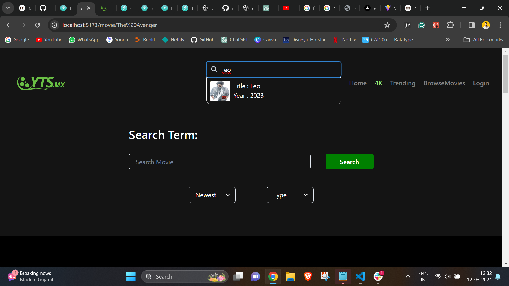
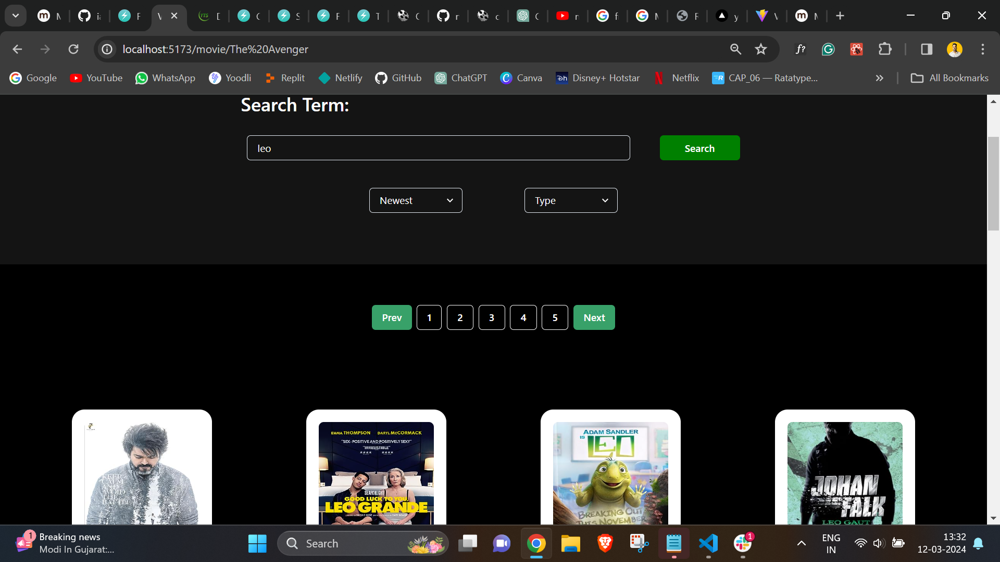
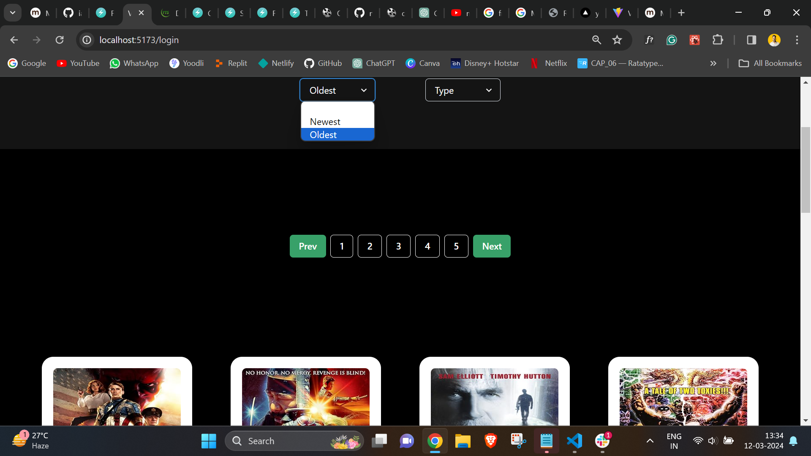
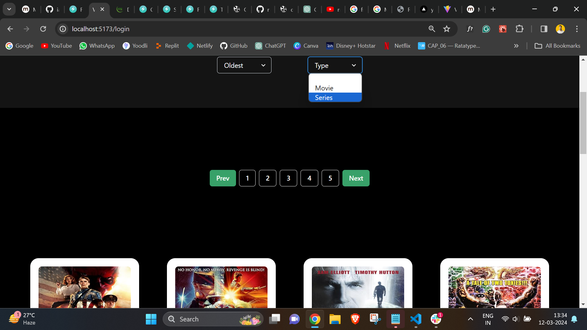
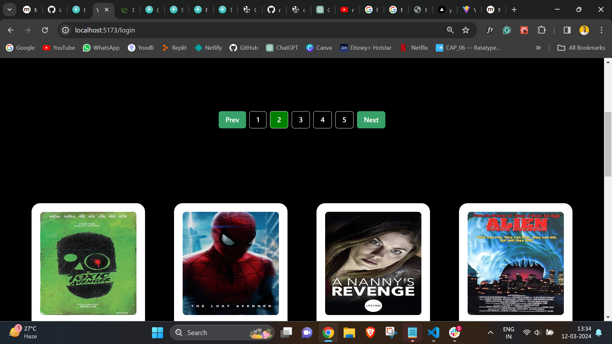
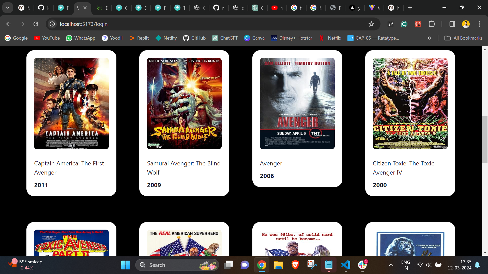
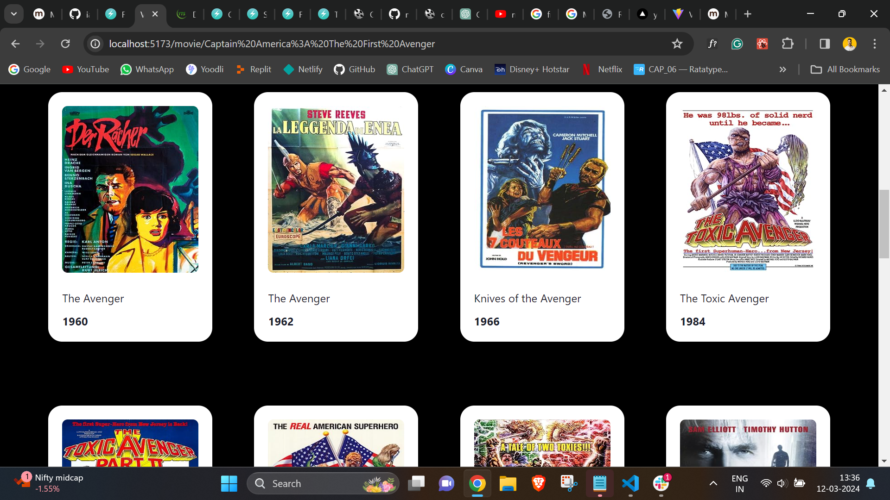
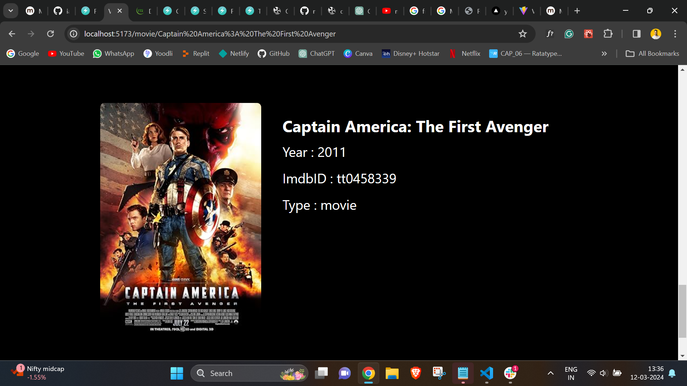

# YTS-MX Movie Search Project

## Functionalities

- `Login` functionality with based on routing 
  - for login i've used reqres api 
    login credentials :- 
         --->  email: "eve.holt@reqres.in,
         ---> password: "cityslicka"
          

-` Debounce effect` on `navbar search input`
  - 

-`Movie Search Bar With Search Button`functionality on the `Home Page` - 

- `Sort by Year` functionality

  - 

- `Filter by Type` functionality

  - 

- `Dynamic Pagination` functionality

  - 

- `Landing page` functionality

  - 

- `Dynamic Movie Card` functionality
- 
- `Dynamic Single Movie Card Details` Data functionality below the UI
- 

## Tech Stack

### React

## Libraries

### React-Router-DOM check[x]

      - Installation check[x]
      - Wrap App component inside BrowserRouter check[x]
      - Dynamic Routing check[x]
      - Dynamic Links check[x]
      - useParams check[x]

### Chakra-UI check[x]

- To create the UI

### Axios check[x]

- To make respective get and post requests to the server

``

## Project Structure

### Component folder wherein following components are :- check[x]

     - Navbar.jsx
     - Footer.jsx

### Routes folder where in i have created check[x]

     - AllRoutes.jsx
     - PrivateRoute.jsx

### Pages check[x]

      - Homepage.jsx
      - MovieData to display movie below the home page while navigate
      - SinglePage.jsx to display single movie details onto ui below the home page
